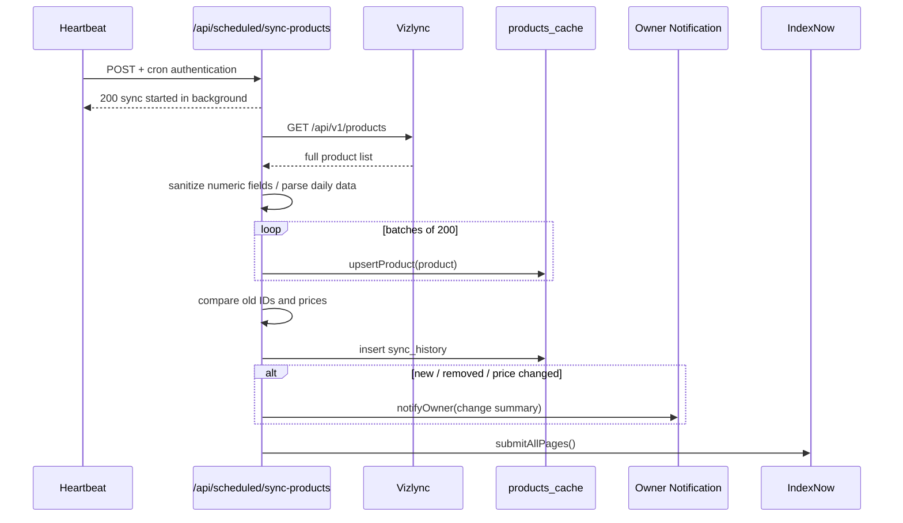
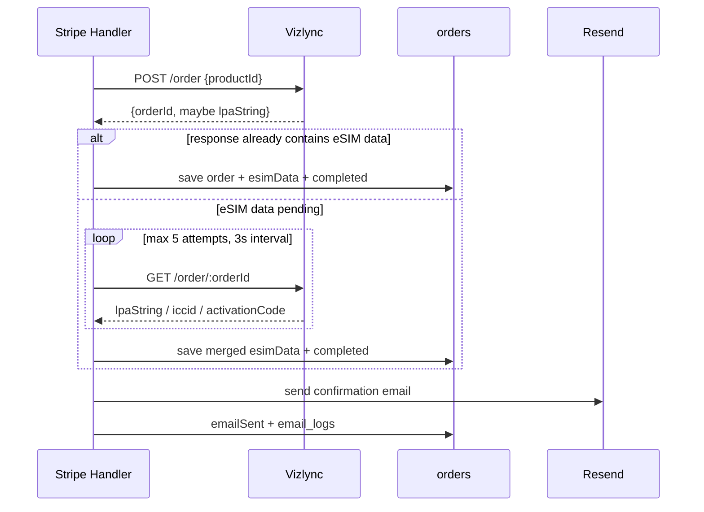
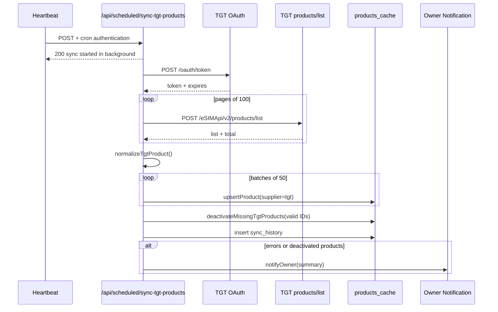
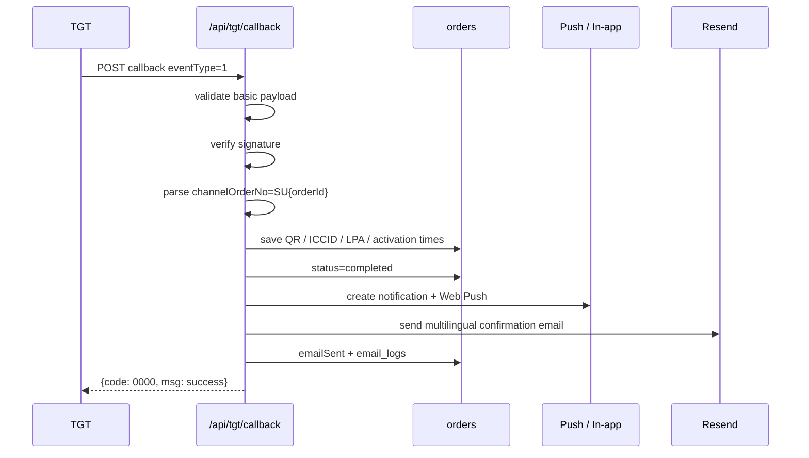
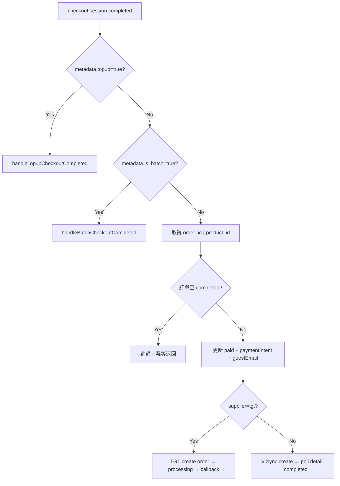
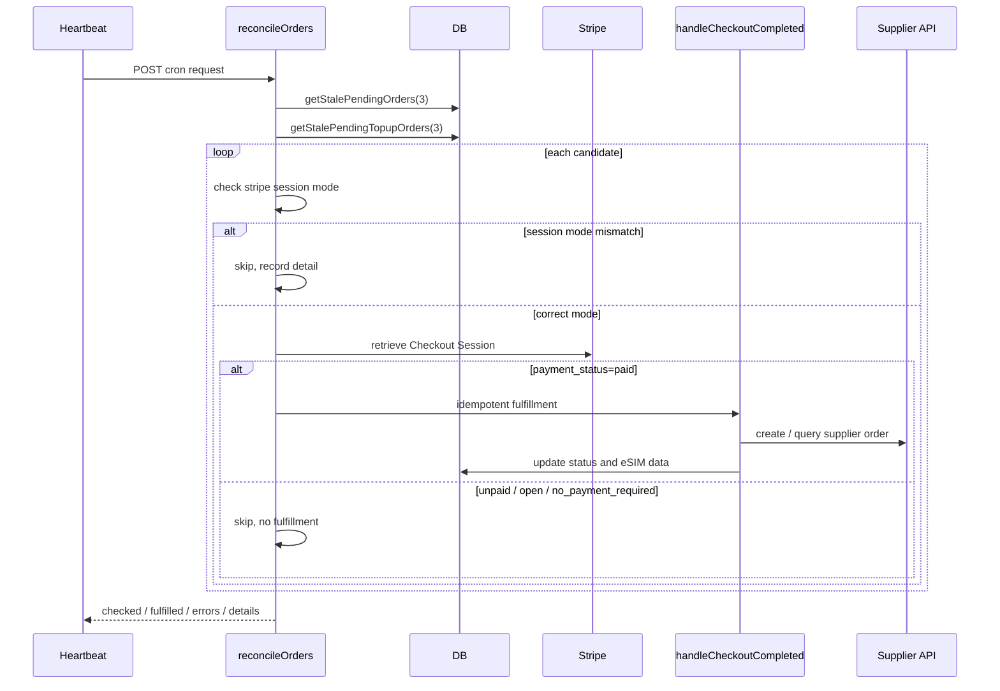
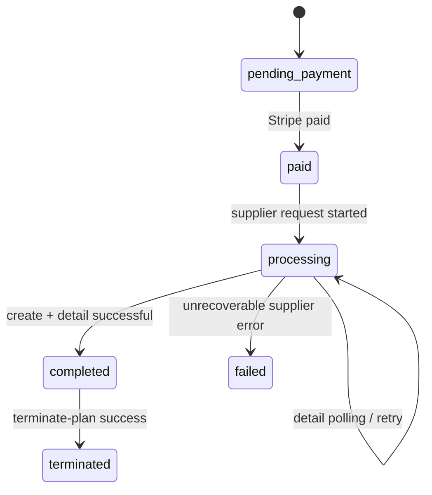
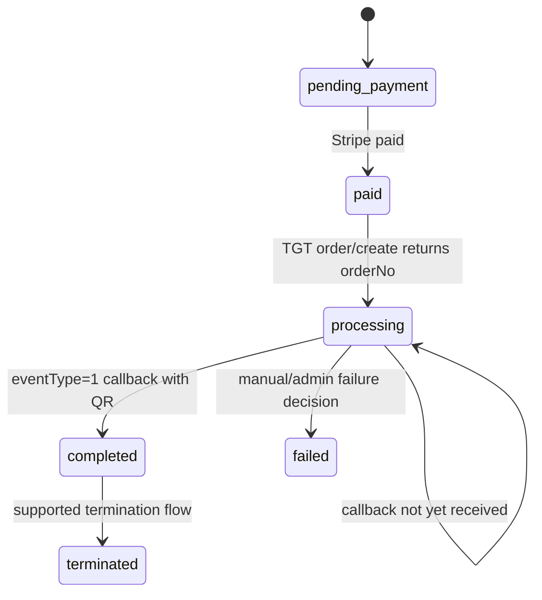

# eSIM 叔叔技術實作架構
## Vizlync／TGT 雙供應商整合、產品同步及 Stripe 付款對帳

> 本文件按目前專案實際程式碼整理，重點說明 API 串流、資料轉換、訂單狀態、排程、冪等、失敗重試及營運監控。
>
> 主要實作檔案：`server/vizlync.ts`、`server/tgt.ts`、`server/stripe.ts`、`server/tgtCallback.ts`、`server/scheduledSync.ts`、`server/scheduledTgtSync.ts`、`server/scheduledReconcile.ts`、`server/db.ts`。

---

# 1. 整體系統架構

```mermaid
flowchart LR
    U[客戶瀏覽器 / PWA] --> APP[React + tRPC API]
    APP --> DB[(MySQL / TiDB)]
    APP --> STRIPE[Stripe Checkout]

    STRIPE -->|checkout.session.completed| WH[Stripe Webhook]
    WH --> FULFILL[付款後履約服務]

    FULFILL -->|Vizlync 產品| VIZ[ Vizlync API ]
    FULFILL -->|TGT 產品| TGT[ TGT API 2.0 ]
    TGT -->|非同步 eventType=1| CB[/api/tgt/callback]
    VIZ --> FULFILL
    CB --> DB

    CRON[Manus Heartbeat] --> SYNCV[/api/scheduled/sync-products]
    CRON --> SYNCT[/api/scheduled/sync-tgt-products]
    CRON --> REC[/api/scheduled/reconcileOrders]
    SYNCV --> VIZ
    SYNCT --> TGT
    REC --> STRIPE
    SYNCV --> DB
    SYNCT --> DB
    REC --> FULFILL
```

系統將「產品同步」、「付款紀錄」、「供應商履約」分成三層：

1. **產品層**：供應商 API → 標準化 → `products_cache`。
2. **付款層**：Stripe Session／Webhook → `orders` 或 `topup_orders`。
3. **履約層**：按產品 `supplier` 分流至 Vizlync 或 TGT，最後將 eSIM 資料寫回 `orders.esimData`。

產品 ID 以供應商作為邏輯 namespace：

- Vizlync：保留 Vizlync product ID。
- TGT：使用 `tgt_` 前綴，例如 `tgt_A-136-ES-ZD-C4-1D_60D-1GB`，避免與 Vizlync ID 衝突。

---

# 2. 供應商抽象層

## 2.1 供應商分流規則

產品同步時會在 `products_cache.supplier` 保存 `vizlync` 或 `tgt`。建立付款 Session 時，Stripe metadata 同樣寫入 `supplier`；若 metadata 缺失，後端再以產品 ID 的 `tgt_` 前綴作 fallback。

```ts
const supplier = input.supplier
  ?? (input.productId.startsWith("tgt_") ? "tgt" : "vizlync");
```

付款完成後，`handleCheckoutCompleted()` 只負責讀取已保存的 supplier 並分流，不讓前端決定實際履約供應商。

## 2.2 共用的本地訂單狀態

| 本地狀態 | 用途 |
|---|---|
| `pending_payment` | 已建立本地訂單／Stripe Session，尚未確認付款 |
| `paid` | Stripe 已付款，尚未完成供應商下單或履約 |
| `processing` | 已向供應商建立訂單，等待 eSIM 資料或需要重試 |
| `completed` | 已取得可用 eSIM 資料並可交付給客戶 |
| `failed` | 付款／履約流程失敗 |
| `terminated` | 方案已被終止 |
| `refunded` | 已退款 |

供應商原始狀態不直接覆蓋本地主狀態，而是保存於 `esimData` 或即時查詢結果中。這樣可同時顯示：

- 平台付款／履約狀態。
- TGT 的 `orderStatus`。
- TGT 的 `profileStatus`。
- Vizlync 的使用量及到期狀態。

---

# 3. Vizlync API 實作

## 3.1 認證及 API Client

檔案：`server/vizlync.ts`

Base URL：

```text
https://api.vizlync.net/api/v1
```

每次呼叫使用以下 Header：

```http
Authorization: Bearer ${VIZLYNC_API_KEY}
X-Partner-ID: ${VIZLYNC_PARTNER_ID}
Content-Type: application/json
```

認證資料只在 server-side 讀取，不會傳到前端。

## 3.2 Vizlync 產品同步 API

### API 呼叫

```http
GET /api/v1/products
```

目前一次取得全部產品；`fetchAllProducts()` 設有：

- Axios timeout：120 秒。
- 進程內記憶體快取：30 分鐘。
- `fetchPromise` 去重：同一時間多個請求只會共用一個進行中的 API 請求。

### 資料轉換

供應商回傳後會先進行數據清洗：

- `price` 轉為 number。
- `validityDays` 轉為 number。
- `voiceMin`、`sms` 轉為 number 或 null。
- 缺少結構化 `dataAmount` 時，從方案名稱解析 `500MB/day`、`1GB/day` 等日費格式。
- 設定 `isDailyPlan`，供前台標籤及篩選使用。
- 保留 `rawData` 作為日後排錯、供應商欄位取回及重新履約的原始快照。

### 寫入資料庫

`scheduledSync.ts` 會將產品以批量方式寫入 `products_cache`：

1. 先讀取現有 Vizlync 產品的 `productId` 及價格。
2. 呼叫 `fetchAllProducts()`。
3. 每批 200 個產品，並行呼叫 `upsertProduct()`。
4. `upsertProduct()` 將 data amount 正規化為 GB，令前台篩選可用同一單位比較。
5. 計算新增、下架／消失及價格變動。
6. 寫入 `sync_history`。
7. 有變動時通知管理員。
8. 最後提交 IndexNow 讓搜尋引擎重新發現頁面變更。

### 產品資料流



## 3.3 Vizlync 建立訂單及 eSIM 交付

### API 呼叫

```http
POST /api/v1/order
Content-Type: application/json

{
  "productId": "...",
  "startDate": "..."
}
```

`startDate` 只在有需要時傳送。

### 付款後串流

Vizlync 的建立訂單通常是同步流程，但 create response 不一定立即包含完整 `lpaString` 或 `iccid`。因此實作為：

1. `createVizlyncOrder(productId)` 建立供應商訂單。
2. 取得 `orderId` 後立即嘗試使用回傳資料。
3. 若沒有 `lpaString`，最多輪詢 5 次。
4. 每次等待 3 秒。
5. 呼叫：

```http
GET /api/v1/order/:orderId
```

6. 只要取得 `lpaString` 或 `iccid` 就合併資料。
7. 寫入：
   - `orders.vizlyncOrderId`
   - `orders.supplierOrderId`（如適用）
   - `orders.esimData`
   - `orders.status = completed`
8. 發送確認電郵及站內通知。



若 5 次後仍未有完整 eSIM 資料，訂單仍會保存供應商訂單 ID及目前資料，並記錄警告；後台可重發／重新履約或管理員介入。

## 3.4 Vizlync 用量及增購

主要 API：

```http
GET /api/v1/usage/:orderId
GET /api/v1/order/:orderId/topup-plans
POST /api/v1/order/:orderId/topup
POST /api/v1/order/:orderId/terminate-plan
GET /api/v1/order/:orderId
```

Vizlync 將每次增購視為獨立供應商訂單，並不一定將增購後的流量寫回主訂單。平台因此：

1. 查詢主訂單用量。
2. 查詢所有已完成的 `topup_orders`。
3. 逐一查詢增購供應商訂單用量。
4. 由 `combineUsage()` 合併 `dataAllowance` 及 `dataUsage`。
5. 保留 breakdown，令前台可分開顯示母卡及各次增購。

增購價格由後端根據：

```text
供應商成本價 × (1 + markup_percentage / 100) × hkd_rate
```

重新計算，不能信任前端傳入的 `priceHkd`。

---

# 4. TGT API 2.0 實作

## 4.1 認證及 Token Cache

檔案：`server/tgt.ts`

Base URL：

```text
TGT_API_BASE_URL
```

### 取得 Token

```http
POST /oauth/token
Content-Type: application/json;charset=UTF-8

{
  "accountId": "TGT_ACCOUNT_ID",
  "secret": "TGT_SECRET"
}
```

TGT 回應為 `body.data.token`，實作會：

- 在 process memory 保存 token。
- 讀取 `expires`，預設 24 小時。
- 提前 5 分鐘刷新。
- 其他 API 統一使用 `Authorization: Bearer <token>`。
- 認證失敗時拋出包含 TGT code／message 的錯誤。

目前 token cache 是單一 server process cache；若日後改為多 instance 部署，可改為 Redis 或資料庫共享 token，避免每個 instance 同時 refresh。

## 4.2 TGT 產品同步 API

### API 呼叫

```http
POST /eSIMApi/v2/products/list
Content-Type: application/json;charset=UTF-8
Authorization: Bearer <token>

{
  "pageNum": 1,
  "pageSize": 100,
  "lang": "en"
}
```

`fetchAllTgtProducts()` 會：

1. 取得 access token。
2. 從 `pageNum=1` 開始。
3. 每頁最多 100 筆。
4. 以 `data.total` 判斷是否完成。
5. 累積所有頁面後回傳完整產品陣列。

### TGT 標準化

`normalizeTgtProduct()` 將 TGT 結構轉成共用的 `products_cache` 形狀：

- `productId = tgt_${productCode}`。
- `name = productName`。
- `price = netPrice`。
- `countries = countryCodeList` 轉為國家 ID／名稱。
- 從國家代碼推導 region。
- `validityDays = usagePeriod`。
- `activationPolicy = activeType`。
- `startDateEnabled` 按啟用模式設定。
- `topUpAvailable` 按 TGT top-up 欄位判斷。
- 保存 TGT 原始資料至 `rawData`。

TGT 某些方案會將數據量放在方案名稱，而不是 `dataTotal`。標準化層會解析：

- `500MB/day`。
- `1GB/day`。
- `每日 1GB`。
- `XGB high speed/day`。
- 其他方案名稱內的 `MB`／`GB`。

這些數據會正規化為 GB，供產品列表、日費篩選及 N/A 修復使用。

### TGT 同步 API 串流



與 Vizlync 不同，TGT 排程目前每批 50 個，使用 `Promise.allSettled()`，因此單一產品寫入失敗不會令整批全部失敗；錯誤會收集到 `errors[]`，最後寫入 `sync_history.failedCount`。

## 4.3 停用已下架產品

TGT 同步完成後，平台會建立本次 API 回傳的有效 product ID 集合，再呼叫 `deactivateMissingTgtProducts()`：

```text
本地 supplier=tgt 且 isActive=true 的產品
    − 本次 TGT API 回傳的 product IDs
    = 應停用產品
```

這些產品不會被刪除，僅更新 `isActive=false`，保留歷史訂單所需資料及產品快照。

## 4.4 TGT 建立訂單 API

```http
POST /eSIMApi/v2/order/create
Content-Type: application/json;charset=UTF-8
Authorization: Bearer <token>

{
  "productCode": "A-136-ES-ZD-C4-1D/60D-1GB",
  "channelOrderNo": "SU123456",
  "idempotencyKey": "su-order-123456",
  "startDate": "2026-07-18T00:00:00.000Z"
}
```

實作的識別欄位：

- `productCode`：由 `products_cache.rawData.productCode` 取得，避免 `tgt_` ID 及 URL-safe ID 破壞原始 product code。
- `channelOrderNo`：固定為 `SU${localOrderId}`，可從 Callback 反查本地訂單。
- `idempotencyKey`：固定為 `su-order-${localOrderId}`，重試時不應建立重複供應商訂單。
- `startDate`：只對支援選擇啟用日期的方案傳送。
- `email`：刻意不傳，避免 TGT 直接寄信；平台統一由自己的 Resend 電郵系統交付。

TGT create API 只保證回傳 `orderNo`，不保證同一回應內有 QR Code，因此建立成功後本地狀態先設為：

```text
orders.status = processing
orders.supplierOrderId = TGT orderNo
```

## 4.5 TGT 非同步 Callback

Callback Endpoint：

```http
POST /api/tgt/callback
```

TGT 文件要求在 10 秒內回應：

```json
{ "code": "0000", "msg": "success" }
```

### Callback 資料流



### TGT Callback 對應欄位

| TGT `orderInfo` | 本地 `esimData` |
|---|---|
| `qrCode` | `qrCode`、`lpaString`、`activationCode`（共用前端格式） |
| `iccid` | `iccid` |
| `imsi` | `imsi` |
| `msisdn` | `msisdn` |
| `activatedStartTime` | `activatedStartTime` |
| `activatedEndTime` | `activatedEndTime` |
| `orderNo` | `tgtOrderNo` |

### Signature

`verifyTgtCallbackSign()` 目前依 TGT 規則：

1. 排除 `sign`。
2. 移除 null、undefined、空字串。
3. 將 nested object flatten 成 `parent.child`。
4. ASCII key 排序。
5. 串接 key + value。
6. 前後加上 TGT secret。
7. MD5 lowercase 比對。

目前 Sandbox／測試邏輯在 signature 不匹配時會記錄警告並繼續處理，以避免供應商重試風暴；正式環境建議將這個行為改為：

- Signature 正確：處理並回 `0000`。
- Signature 錯誤：記錄安全事件，拒絕更新訂單，按 TGT 文件要求回錯誤或安全 acknowledgement。
- 所有 Callback 都記錄 eventType、orderNo、channelOrderNo、timestamp 及處理結果。

### 重複 Callback

Callback 可能因網絡延遲重送。現有流程使用固定 `channelOrderNo` 對應本地訂單，並以更新同一筆 `orders` 作為基本冪等機制。建議進一步加入：

- `tgt_callback_events` 表。
- `idempotencyKey`／`eventType` unique key。
- 已 completed 且已有 QR Code 時直接回成功，不重發電郵。

---

# 5. Stripe 付款至供應商履約

## 5.1 建立主訂單 Checkout Session

### 本地先建單

`createCheckoutSession()` 會先在資料庫建立 `pending_payment` 訂單，再建立 Stripe Session。這能確保付款前已有本地 `orderId`，可寫入 metadata 及追蹤後續狀態。

```text
createOrder()
  → status=pending_payment
  → create Stripe Checkout Session
  → 寫回 stripeSessionId
```

Stripe metadata 主要包括：

```json
{
  "order_id": "123456",
  "product_id": "tgt_...",
  "product_name": "...",
  "supplier": "tgt",
  "customer_email": "...",
  "preferred_lang": "zh-TW",
  "start_date": "...",
  "referral_code_id": "..."
}
```

前端只傳 `productId` 等輕量資料；後端再從 DB 讀取完整產品，避免 iOS Safari／PWA 因數十 KB tRPC payload 而把原始 JSON 顯示在頁面。

## 5.2 Stripe Webhook Endpoint

```http
POST /api/stripe/webhook
```

Express 必須先使用：

```ts
express.raw({ type: "application/json" })
```

再交給 `stripe.webhooks.constructEvent()` 做簽章驗證。這個 route 必須註冊在 `express.json()` 前，否則 raw body 會被解析而導致 Stripe signature 驗證失敗。

目前處理：

- `checkout.session.completed`：付款成功後分流履約。
- `payment_intent.payment_failed`：記錄付款失敗。
- 其他事件：記錄但不處理。

## 5.3 付款成功的共用分流



付款電郵的 customer email 取值優先次序：

1. `session.customer_details.email`。
2. `session.customer_email`。
3. `metadata.customer_email`。
4. `metadata.guest_email`。

成功後也會寫回 `orders.guestEmail`，確保訪客能用電郵查詢訂單。

---

# 6. 付款對帳及漏 Webhook 補救

## 6.1 為何需要對帳

付款成功、Webhook 收不到或伺服器短暫失敗時，會出現：

```text
Stripe payment_status = paid
本地 orders.status = pending_payment
```

如果只依賴 Webhook，客戶已付款但 eSIM 不會建立。平台因此有三層補救：

1. Stripe Webhook 即時處理。
2. Checkout 成功頁回到網站後，即時呼叫 `confirmAndFulfillBySession()`。
3. Heartbeat 每隔一段時間掃描 stale pending orders，呼叫 `reconcilePendingOrders()`。

## 6.2 對帳 API Endpoint

```http
POST /api/scheduled/reconcileOrders
```

驗證：

- 透過 `sdk.authenticateRequest(req)`。
- 必須為 `user.isCron`。
- 非 Cron 回 403。
- 認證失敗／4xx 不當作 server 500，避免排程無限重試。

## 6.3 對帳查詢範圍

`getStalePendingOrders(olderThanMinutes)` 查詢有 Stripe Session ID 且建立超過門檻的訂單；增購訂單則由 `getStalePendingTopupOrders()` 查詢。

目前 handler 呼叫：

```ts
reconcilePendingOrders(3)
```

即掃描建立超過 3 分鐘仍未完成的主訂單及增購訂單。

## 6.4 對帳串流



## 6.5 Stripe mode mismatch protection

正式環境使用 live key、測試環境使用 test key；兩者不能互相 retrieve Session。對帳前會依 Session ID 前綴判斷：

- live key + `cs_test_`：skip。
- test key + `cs_live_`：skip。
- 同模式才呼叫 Stripe retrieve。

這可避免歷史測試訂單令正式對帳工作持續產生錯誤。

## 6.6 對帳的冪等保護

`handleCheckoutCompleted()` 是 Webhook、成功頁及對帳共用的履約入口。開始時會：

```ts
const existingOrder = await getOrderByStripeSession(session.id);
if (existingOrder?.status === "completed") return;
```

因此同一 Session 可能被以下多個來源同時觸發，仍不應重複寄送或重複建立供應商訂單：

```text
Webhook
成功頁 confirmPayment
reconcileOrders
管理員補發／重試
```

TGT 另有固定：

```text
channelOrderNo = SU{orderId}
idempotencyKey = su-order-{orderId}
```

Vizlync 則以本地訂單完成狀態、已保存 `vizlyncOrderId` 及供應商查詢結果作防重。

## 6.7 對帳結果

`reconcilePendingOrders()` 回傳：

```ts
{
  checked: number,
  fulfilled: number,
  errors: number,
  details: [
    {
      type: "order" | "topup",
      id: number,
      sessionId: string,
      action: "fulfilled" | "error" | "skipped (...)"
    }
  ]
}
```

這個結果適合寫入排程 Log 或監控頁面，例如：

```text
Checked=6, Fulfilled=1, Errors=0
```

---

# 7. 訂單狀態流轉

## 7.1 Vizlync



## 7.2 TGT



TGT 的 `processing` 是正常中間狀態，不代表一定失敗；因為 QR Code 由 Callback 非同步交付。

---

# 8. 失敗處理、重試及營運補救

## 8.1 產品同步失敗

### Vizlync

- 單次全量 API 失敗：寫入 `sync_history.status=failed`。
- 發送 owner notification。
- 不會因無法取得新資料而刪除現有產品。
- 下一次排程重新嘗試。

### TGT

- OAuth 失敗：整次同步失敗並通知管理員。
- 單一 upsert 失敗：由 `Promise.allSettled()` 收集，不阻塞其他產品。
- 寫入 `failedCount` 及前五個錯誤。
- API 不再提供的產品：設 `isActive=false`，不刪除。
- 需要時由後台手動同步。

## 8.2 付款成功但供應商下單失敗

主訂單會保留：

- Stripe Payment Intent。
- Stripe Session。
- 本地訂單。
- `status=processing`。
- `errorMessage`。

管理員可在 `/admin/orders`：

- 查看失敗原因。
- 重試電郵。
- 查詢供應商狀態。
- 使用「補發 eSIM」重新呼叫 Vizlync／TGT create order。

## 8.3 eSIM 資料未即時返回

- Vizlync：Webhook handler 內最多 5 次、每次 3 秒輪詢。
- TGT：等待 Callback；Callback 收到後補寫資料及發信。
- 前台：若資料未完成，顯示處理中而非誤顯示空 QR。
- 管理員：可以看到 `esimData` 狀態及 Email Sent 狀態。

## 8.4 電郵失敗

履約與電郵分離：即使電郵失敗，訂單及 eSIM 資料仍保存。系統會：

- 將 `orders.emailSent=false`。
- 寫入 `email_logs.status=failed`。
- 後台顯示未發送警示。
- 管理員可重發。
- 電郵重試排程可處理符合條件的失敗記錄。

---

# 9. 建議的生產級強化項目

以下是目前程式已具備基礎，但若要提高長期穩定性，建議優先處理：

## 9.1 Callback 事件表

新增 `tgt_callback_events`：

| 欄位 | 用途 |
|---|---|
| `id` | 自增主鍵 |
| `eventId`／`idempotencyKey` | unique，防重複事件 |
| `eventType` | TGT event type |
| `channelOrderNo` | 對應本地訂單 |
| `orderNo` | TGT 訂單 |
| `payloadHash` | 排錯及去重 |
| `signatureValid` | 安全稽核 |
| `processingStatus` | received／processed／failed |
| `receivedAt` | 接收時間 |
| `processedAt` | 完成時間 |
| `errorMessage` | 失敗原因 |

## 9.2 履約工作隊列

現時 Webhook 內會直接進行部分履約工作。更高流量時可改為：

```text
Webhook / Callback
  → 快速驗證及寫入 event
  → 回應 200
  → queue worker 執行履約、輪詢、電郵及通知
```

好處是：

- 不受供應商慢 API 影響 Webhook timeout。
- 可做 exponential backoff。
- 可按供應商分開 rate limit。
- 可從失敗隊列重播。

## 9.3 API rate limit 及 backoff

現時主要以 batch、timeout 及有限輪詢保護。建議統一加入：

- 429／5xx retry with exponential backoff。
- 每個供應商的 concurrency limit。
- `Retry-After` 支援。
- request correlation ID。
- 每次 API 呼叫記錄 supplier、endpoint、orderId、duration、status code。

## 9.4 付款及履約資料庫鎖

若 Webhook、成功頁及對帳同時觸發，建議在 DB 層加入：

- `orders.fulfillmentLockAt`。
- `orders.fulfillmentAttemptCount`。
- `orders.fulfillmentKey` unique。
- transaction／row lock。

這能令「讀取未完成 → 同時兩次 create supplier order」的 race condition 更難發生。

## 9.5 Secret 及環境檢查

部署時應檢查：

```text
VIZLYNC_API_KEY
VIZLYNC_PARTNER_ID
TGT_API_BASE_URL
TGT_ACCOUNT_ID
TGT_SECRET
STRIPE_SECRET_KEY
STRIPE_WEBHOOK_SECRET
RESEND_API_KEY
```

並在健康檢查中區分：

- Token 無法取得。
- API 可連線但帳戶無權限。
- API 回傳產品為 0 筆。
- Stripe key 為 test/live 不匹配。
- Callback signature secret 不一致。

---

# 10. API 流程摘要表

| 流程 | 入口 | 主要 API | 本地結果 |
|---|---|---|---|
| Vizlync 產品同步 | Heartbeat `/api/scheduled/sync-products` | `GET /api/v1/products` | Upsert products_cache、停用／變更統計 |
| TGT 產品同步 | Heartbeat `/api/scheduled/sync-tgt-products` | `POST /oauth/token` → `POST /eSIMApi/v2/products/list` | 標準化後 Upsert、停用下架產品 |
| 主產品付款 | Stripe Checkout | `checkout.session.completed` | 更新 paid，進入供應商履約 |
| Vizlync 履約 | 共用付款 handler | `POST /api/v1/order` → `GET /api/v1/order/:id` | 保存 eSIM，completed，寄電郵 |
| TGT 履約 | 共用付款 handler | `POST /eSIMApi/v2/order/create` | 保存 orderNo，processing，等待 Callback |
| TGT eSIM 交付 | `/api/tgt/callback` | TGT server-to-server POST | 保存 QR／ICCID，completed，通知及寄電郵 |
| Vizlync 用量 | 會員／後台查詢 | `GET /api/v1/usage/:id` | 顯示用量／增購合併結果 |
| TGT 用量 | 會員／後台查詢 | `POST /eSIMApi/v2/order/usage` | 顯示 dataTotal／dataUsage／dataResidual |
| Stripe 主訂單對帳 | Heartbeat `/api/scheduled/reconcileOrders` | `stripe.checkout.sessions.retrieve()` | 已付款但漏 Webhook → 共用履約 handler |
| Stripe 增購對帳 | 同上 | `stripe.checkout.sessions.retrieve()` | 已付款但未完成 → 增購供應商履約 |
| Checkout 即時補單 | 成功頁 tRPC | `confirmAndFulfillBySession()` | 不等下一次排程，立即補單 |

---

# 11. 最重要的設計原則

1. **前端不決定實際價格及供應商**：後端按產品資料庫重算價格及分流。
2. **Stripe 是付款事實來源**：本地 `pending_payment` 不是付款成功證明，必須查 Stripe `payment_status`。
3. **Webhook 不是唯一履約入口**：成功頁及定時對帳都能安全呼叫相同的冪等履約 handler。
4. **Vizlync 與 TGT 的交付模型不同**：Vizlync 需要建立後輪詢；TGT 需要建立後等待 Callback。
5. **下架產品不刪除**：只停用，保留歷史訂單及產品快照。
6. **供應商原始資料要保存**：`rawData` 用於補發、欄位排錯及日後 API 擴展。
7. **所有外部 API 都要有 timeout、錯誤紀錄及可重試策略**。
8. **付款、Callback、同步及電郵都要可觀察**：使用 `sync_history`、`email_logs`、`errorMessage`、owner notification 及詳細 Log。
